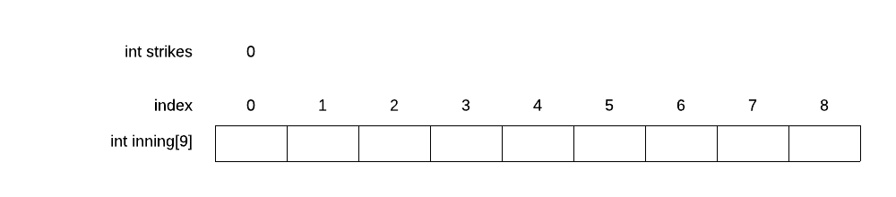

# Project - DnD Character Generator

## Goal

You’ll write a very simple Dungeons and Dragons character generator. Nothing too fancy.

In this project you will use a number of new or recently introduced techniques and technologies. These include:

* C++ `string`
* C++ `vector`
* Global variables
* Random number generation

## Review

### Arrays and vectors

C arrays are introduced in section 5.1 of Zybooks. Reading about C arrays might be helpful in that we will use C++ vectors pretty much the same way one would use arrays.

Imagine an integer, `strikes`. It holds just one value. Now imagine a box score for the home team - it typically contains 9 integers in a row, like this:



Remember that an `array` of *n* elements has indicies ranging from *0* to *n - 1*. Individual members of an `array` are accessed like so:

```c++
// print first and fourth inning score
cout << innings[0] << " " << innings[3];
```

Individual members of a `vector` can be accessed the same way.

A C `array` is defined like so:

```c
int innings[9];
```

Notice that this builds an `array` that has specifically 9 members. No more and no less. While it is technically possible to change the size of an `array`, doing so requires building an entirely new `array` from scratch and copying the old contents to the new `array`.

A C++ `vector` can be used like an `array` but is way more flexible. For one thing, the size of a `vector` is easily changed. For example:

```c++
vector<int> innings;   // declares an empty vector
innings.push_back(0);  // vector now has one element
innings.push_back(4);  // vector now has two elements
```

A C++ `vector` has self-knowledge - you can ask it for information about itself like its size. 

```c++
cout << "Length of the vector is: " << innings.size() << endl;
```

**Warning: There are dragons before and after a `vector`. Bad things happen when you poke dragons.**

### Random numbers

You can get a "random" number by calling ```rand()```. This function returns an integer between ```0``` and ```RAND_MAX```. The value of ```RAND_MAX``` is guaranteed to be at least 32767 but in modern times it is far far larger.

If you do not seed the *RNG* you will get the same sequence of "random numbers". Seeding the RNG is done with ```srand(unsigned int seed)```. If you use the same value to ```seed``` , you get the same sequence. This is a **good idea** when testing code that uses random numbers.

In general, you want to `seed` with different values. To get the "most" random output from ```rand()``` you will typically call ```srand()``` with the time-of-day like so:

This assumes ```<ctime>``` has been included. 

```c++
srand((unsigned int)time(0));
```

In this project you will ask the user for the seed value. If they enter 0, you should use `time()`. If they enter non-zero, you should use that value as the seed.

## References to zybooks

Some new material includes:

* C arrays are introduced in 5.1 and discussed in class
* C strings introduced in 5.14
* C++ vectors are introduced in 5.2 and discussed in class
* C++ strings are introduced in 2.14 and discussed in class
* Random numbers - all of 2.18 in the etextbook
* Random numbers within a specific range - participation activity 2.18.4 and 2.18.5 and the text preceding these activities
* ```getline()``` covered in 2.14 of the etextbook.

Some practice concepts:

* splitting the big job of a program into smaller functions

## Requirements

You must follow these requirements exactly.

### Ask for seed for random number generator

Your program must first ask for a random seed. If the user inputs 0, the seed with random number generator with the current time-of-day. If the value is non-zero, use that value as the seed.

### You must be able to generate more than one character per program execution

Your program must loop, asking for character names that may contain spaces, until the word "quit" is entered.

Your program must loop, asking for character names that may contain spaces, until the word "quit" is entered.

Your program must loop, asking for character names that may contain spaces, until the word "quit" is entered.

If your program does not loop until the word "quit" is entered, there will be a substantial point deduction.

What kind of loop is a good first recourse when you don't know in advance how many loops you'll need? The `while` loop.

### You must write three functions to return attribute strings

There are three attributes of a DnD character for which you will write specific functions. These are their signatures.

```c++
string ChooseRace();
string ChooseAlignment();
string ChooseBehavior();
```

Each chooses one value from an array of predefined values at random.

### `ChooseRace()`

```c++
ChooseRace()
```

can return one of:

* Human
* Orc
* Elf
* Dwarf
* Professor

### `ChooseAlignment()`

```c++
ChooseAlignment()
```

can return one of:

* Lawful
* Neutral
* Chaotic

### `ChooseBehavior()`

```c++
ChooseBehavior()
```

can return one of:

* Good
* Neutral
* Evil

### `RangeRand()`

You must write a function returning a random number within a give range. It will have the signature:

```c++
int RangeRand(int min, int max);
```

It will return a random integer whose minimimum value is specified as the first argument. Its maximum value is one less than the second argument. For example ```RangeRand(0, 10)``` returns a random integer from 0 to (including) 9. The mod operator ```%``` is important here.

Sound out what this function is supposed to do. It can produce `max - min` different values that have a minimum value of `min`.

### `PickStat()`

You must write a function return a **string** representing a "stat". 

Stats can range between 6 and 18 inclusive. 

The highest (18) is special. If you roll an 18 (choose 18 at random) the character gets a special massive boost which comes in the form of a number between 0 and 100 inclusive. Because of this, your function returns a string - not a number.

```c++
string PickStat();
```

See the sample output for an example of non-18 values and one special 18 value. You will choose stats for:

* Strength
* Dexterity
* Intelligence
* Charisma
* Wisdom

Health is different - it ranges from 6 to 30 inclusive. 

### Concatenating C++ strings and converting numbers to C++ strings

You can "add" two C++ strings together and convert numbers to strings. Here is an example:

```c++
int agent_number = 99;
string s = "Hello there, Agent " + to_string(agent_number);
```

This results in the variable ```s``` containing ```Hello there, Agent 99```.

Recall above, that if you roll an 18, you must also choose a modifier in the range of 0 to 100 inclusive. String concatenation is an easy way to handle the 18 case.

## Hint - include files

As a hint, here are the include files I used when writing my implementation:

```c++
#include <vector>
#include <ctime>
#include <iostream>
#include <string>
```

*Style: Sometimes you can have dozens of includes - fact of life. If they are in an order (perhaps size or alphabetized), they are easier to read through.*

## DANGER - READ THIS

You will use `cin` to get the seed value from the user. But you will use `getline()` to get a whole string of potentially several words for the character's name.

**Mixing `cin` and `getline()` is a big problem.** `cin` does not strip the new line character after the number you enter for the seed. This means that the next call to `getline()` will see the new line character and return immediately with an empty string.

First, you *must* prevent this using `cin.ignore()`:

```c++
cout << "Enter random seed value: ";
cin >> seed;
cin.ignore();
```

Second, you must ignore empty strings returned to you by `getline()`. You are in a `while` loop, right? What statement causes the loop to skip back to the top?

## Sample output

Notice two things about the sample output shown below.

First, blank answers are simply skipped. Your program must have this behavior.

Second, a multiple word entry is treated as all together as a single entry. This is not the case when you use the input operator ```>>```. Instead of something like:

```c++
cin >> character_name;
```

You will use ```getline()```. This material is covered in chapter 2.14 in your etextbook.

```text
% ./a.out
Enter random seed value: 10

Enter character's name - use "quit" to exit: Hector the Horrible
Hector the Horrible (Human) is Neutral alignment and Good behavior
Health: 25
Strength: 12
Dexterity: 18 / 13
Intelligence: 15
Charisma: 9
Wisdom: 6

Enter character's name - use "quit" to exit: Furry Curry Murray
Furry Curry Murray (Professor) is Neutral alignment and Good behavior
Health: 28
Strength: 8
Dexterity: 8
Intelligence: 12
Charisma: 14
Wisdom: 8

Enter character's name - use "quit" to exit: quit
%
```

## Partner rules

All work is solo.

## What to turn in and how

Turn in your single C++ source code file via schoology.

## Grading

Grading is out of 100 points.

You will receive zero points if:

* You do not hand in a project.
* You hand in a file which is not cpp source code.
* Your code does not compile to completion.
* Your code is substantially incomplete.

You will receive ten points off if compiling your code produces *any* warnings.

You will receive ten points off if your name is not at the top of the program.

You will receive five points off for every required function that is missing, incomplete, or not according to specification. These are are:

```c++
string ChooseRace();
string ChooseAlignment();
string ChooseBehavior();
int RangeRand(int min, int max);
string PickStat();
```

You will receive five points off **you** calculate the number of potential choices for Race, Alignment or Behavior yourself. Instead you shoud use `size()` of the `array`.

You will receive ten points off if your code produces any wrong results.

You will receive thirty points off if your code has an infinite loop or crashes.

If you have run afoul of none-of-the-above, you receive 100 percent.

## Postscript

Here is Hector being Horrible:


Here is Murray being Furry after eating Curry:


